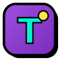

<p align="center">
  
</p>

<h1 align="center">TuskForm</h1>

<p align="center">
  <strong>Decentralized Feedback Engine on SUI Mainnet</strong>
</p>

<p align="center">
  Build custom forms. Encrypt with Seal. Store on Walrus. Your data, your keys.
</p>

<p align="center">
  <a href="#features">Features</a> &nbsp;·&nbsp;
  <a href="#tech-stack">Tech Stack</a> &nbsp;·&nbsp;
  <a href="#getting-started">Getting Started</a> &nbsp;·&nbsp;
  <a href="#architecture">Architecture</a> &nbsp;·&nbsp;
  <a href="#theming">Theming</a> &nbsp;·&nbsp;
  <a href="#deployment">Deployment</a>
</p>

---

## Overview

TuskForm is a decentralized feedback platform built on the **SUI blockchain**. It enables anyone with a SUI wallet to create fully customizable forms — bug reports, feature requests, surveys, applications, and more — with submissions stored permanently on **Walrus** decentralized storage and optional **Seal** client-side encryption for sensitive data.

No servers. No databases. No accounts. Just your wallet and the blockchain.

---

## Features

### Form Builder
- **8 Field Types** — Short Text, Rich Text, Dropdown, Checkboxes, Star Rating, URL Link, Media Upload, Confirmation Checkbox
- **Drag & Reorder** — Move fields up/down with one click
- **Required / Optional** — Toggle field requirements per question
- **Category Tagging** — Bug Report, Feature Request, Product Feedback, Survey, Application, Other
- **Shareable Links** — Every form gets a unique public URL (`/f/:id`)

### Theming System
- **9 Built-in Themes** — Clean White, Midnight Purple, Ocean Wave, Sunset Glow, Aurora Borealis, Neon Cyber, Forest Moss, Lavender Dream, Custom
- **Animated Backgrounds** — Gradient animations, floating particle effects, neon pulses
- **Custom Colors** — Color pickers for background, accent, and text
- **Background Images** — Paste any image URL for a custom backdrop
- **Text Alignment** — Left / Center / Right controls for title and description independently

### Decentralized Storage (Walrus)
- **Immutable Blob Storage** — Every form submission is uploaded as a JSON blob to the Walrus network
- **File Uploads** — Images and videos (up to 10 MB) stored directly on Walrus
- **Multi-Publisher Fallback** — Automatic failover across community publisher endpoints
- **Verifiable** — Each submission returns a `blobId` that can be independently verified on-chain

### Privacy & Encryption (Seal)
- **Optional Per-Form Toggle** — Form creators choose whether to encrypt submissions
- **Client-Side Encryption** — Data is encrypted before it leaves the browser
- **Zero-Knowledge** — Only the form creator and approved admins can decrypt responses

### Admin Dashboard
- **Wallet-Gated Access** — Only the form creator's SUI wallet can access the admin panel
- **Submission Management** — View, filter, and search all incoming responses
- **Status Tracking** — New → Reviewed → In Progress → Resolved → Archived
- **Priority Ranking** — Critical / High / Medium / Low / None
- **Internal Notes** — Add private team annotations to any submission
- **Custom Tags** — Label and categorize responses for organization
- **CSV Export** — Download all submissions as a spreadsheet
- **Live Stat Cards** — Real-time counts for Total, New, Reviewed, and Resolved submissions

### Design
- **Neubrutalist UI** — Bold borders, thick shadows, high-contrast colors, uppercase typography
- **Custom SVG Icons** — Hand-crafted illustrations for every use case (no generic emoji)
- **Micro-Animations** — Shimmer buttons, floating shapes, spring hover effects, staggered reveals
- **Marquee Banners** — Animated text strips for visual energy
- **Fully Responsive** — Mobile-first design that works on all screen sizes

---

## Tech Stack

| Layer | Technology |
|---|---|
| **Framework** | React 19 + TypeScript |
| **Build Tool** | Vite 8 |
| **Blockchain** | SUI Mainnet (`@mysten/dapp-kit`, `@mysten/sui`) |
| **Storage** | Walrus Decentralized Blob Storage |
| **Encryption** | Seal (client-side) |
| **State** | Zustand (In-Memory) + SUI Blockchain Indexing |
| **Routing** | React Router v7 |
| **Animation** | Framer Motion |
| **Icons** | Lucide React + Custom SVG components |
| **Fonts** | Outfit + Space Grotesk (Google Fonts) |

---

## Getting Started

### Prerequisites

- **Node.js** 18+
- **npm** or **yarn**
- A **SUI-compatible wallet** (Sui Wallet, Suiet, Ethos, etc.)

### Installation

```bash
# Clone the repository
git clone https://github.com/sandman-sh/TuskForm.git
cd TuskForm

# Install dependencies
npm install

# Start development server
npm run dev
```

The app will be available at `http://localhost:5173/`.

### Environment Variables

Create a `.env` file in the project root (one is included by default):

```env
# SUI Network
VITE_SUI_NETWORK=mainnet

# Walrus Storage Endpoints
VITE_WALRUS_PUBLISHER=https://publisher.walrus.site/v1/blobs
VITE_WALRUS_AGGREGATOR=https://aggregator.walrus.site/v1/blobs

# Fallback publishers (comma-separated)
VITE_WALRUS_FALLBACK_PUBLISHERS=https://walrus-mainnet-publisher-1.staketab.org/v1/blobs

# Seal Protocol Package ID (Mainnet)
VITE_SEAL_PACKAGE_ID=0xYOUR_PACKAGE_ID
```

---

## Architecture

```
src/
├── main.tsx                 # App entry — SUI provider, wallet, query client
├── App.tsx                  # Route definitions
├── index.css                # Complete design system (Neubrutalist tokens)
│
├── components/
│   └── Icons.tsx            # Custom SVG icon components (10 illustrations)
│
├── lib/
│   ├── walrus.ts            # Walrus HTTP client (upload, download, file handling)
│   ├── seal_sdk.ts          # Official @mysten/seal SDK wrapper
│   └── themes.ts            # Theme engine (9 presets, CSS generation)
│
├── pages/
│   ├── LandingPage.tsx      # Public landing with hero, use cases, features
│   ├── FormBuilder.tsx      # Wallet-gated form creation + theme picker
│   ├── FormView.tsx         # Wallet-gated form submission (themed, animated)
│   └── AdminDashboard.tsx   # Wallet-gated submission management
│
└── store/
    └── store.ts             # Zustand in-memory state caching
```

### Data Flow (100% On-Chain)

```
┌─────────────────────────────────────────────────────────┐
│                     Form Creator                        │
│  (SUI Wallet Connected)                                 │
│                                                         │
│  1. Creates form in FormBuilder                         │
│  2. Chooses theme, fields, encryption toggle            │
│  3. Saves → Form metadata uploaded to Walrus            │
│  4. Signs SUI Tx → FormAdminCap minted & Form shared    │
│  5. Gets shareable link: /f/0x... (SUI Object ID)       │
└──────────────────────┬──────────────────────────────────┘
                       │
                       ▼
┌─────────────────────────────────────────────────────────┐
│                     Respondent                          │
│  (SUI Wallet Required)                                  │
│                                                         │
│  1. Opens shared link → themed form renders             │
│  2. Fills out fields, uploads media                     │
│  3. Submits → payload uploaded to Walrus                │
│  4. Signs SUI Tx → add_submission to Form Object        │
└──────────────────────┬──────────────────────────────────┘
                       │
                       ▼
┌─────────────────────────────────────────────────────────┐
│                   Walrus Network                        │
│                                                         │
│  • JSON blobs stored permanently                        │
│  • Media files stored as separate blobs                 │
│  • Retrievable via blobId from any aggregator           │
└──────────────────────┬──────────────────────────────────┘
                       │
                       ▼
┌─────────────────────────────────────────────────────────┐
│                  Admin Dashboard                        │
│  (Creator's wallet only)                                │
│                                                         │
│  • Finds owned FormAdminCap objects via SUI indexer     │
│  • Reads Form Shared Object + submissions               │
│  • Fetches payloads from Walrus                         │
│  • Export to CSV                                        │
│  • Decrypt Seal-encrypted responses                     │
└─────────────────────────────────────────────────────────┘
```

---

## Theming

TuskForm includes a powerful theming system that lets form creators customize the look and feel of their public forms.

### Available Presets

| Theme | Style | Background |
|---|---|---|
| **Clean White** | Light, minimal | Dotted grid pattern |
| **Midnight Purple** | Dark, dramatic | Animated purple gradient |
| **Ocean Wave** | Deep blue | Animated blue-cyan gradient |
| **Sunset Glow** | Warm, fiery | Animated orange-red gradient |
| **Aurora Borealis** | Dark green | Slow-shifting green aurora |
| **Neon Cyber** | Black + neon | Radial neon glow (magenta/cyan) |
| **Forest Moss** | Deep green | Animated dark green gradient |
| **Lavender Dream** | Soft purple | Gentle pastel purple gradient |
| **Custom** | User-defined | Custom colors + optional image |

### Theme Features
- **Animated gradient backgrounds** with 12–20 second animation cycles
- **Floating particle system** — 4 blurred, animated orbs on dark themes
- **Dark mode input overrides** — Translucent inputs with proper contrast
- **Glassmorphic cards** — `backdrop-filter: blur` on dark themes
- **Accent-colored elements** — Submit button, title, stars adapt to theme

---

## Security Model

### Wallet Authentication
- **SUI Mainnet** wallet connection via `@mysten/dapp-kit`
- Form builder and admin dashboard are **gated by wallet address**
- Each form stores the creator's `adminAddress` — only that wallet can manage it
- Additional wallets can be added to `approvedAdmins` for team access

### Seal Encryption (Optional)
- When enabled, submission data is encrypted **client-side** before upload
- Encrypted payloads are stored on Walrus — the network only sees ciphertext
- Only the form creator can decrypt responses in the admin dashboard

### Walrus Storage
- Submissions are uploaded via `PUT /v1/blobs` to Walrus publishers
- Each upload returns a unique `blobId` for permanent retrieval
- The aggregator endpoint provides free, public read access
- Multi-publisher fallback ensures upload resilience

---

## Scripts

```bash
# Development server with HMR
npm run dev

# Type-check and build for production
npm run build

# Preview production build
npm run preview

# Lint
npm run lint
```

---

## Deployment

### Vercel

```bash
# Install Vercel CLI
npm i -g vercel

# Deploy
vercel
```

Set the following in Vercel's environment settings:
- `VITE_SUI_NETWORK` = `mainnet`
- `VITE_WALRUS_PUBLISHER` = your publisher URL
- `VITE_WALRUS_AGGREGATOR` = your aggregator URL

### Static Export

```bash
npm run build
# Output in dist/ — deploy to any static host
```

---

## Project Structure

```
TuskForm/
├── public/
│   └── favicon.svg          # Custom neubrutalist favicon
├── src/
│   ├── components/          # Reusable UI components
│   ├── lib/                 # Walrus, Seal, Theme engine
│   ├── pages/               # Route-level page components
│   ├── store/               # Zustand state management
│   ├── index.css            # Design system + animations
│   └── main.tsx             # App bootstrap
├── .env                     # Environment configuration
├── index.html               # HTML entry point
├── package.json
├── tsconfig.json
└── vite.config.ts
```

---

## Supported Field Types

| Type | Description | Features |
|---|---|---|
| **Short Text** | Single-line text input | Placeholder, required toggle |
| **Rich Text** | Multi-line textarea | Placeholder, expandable |
| **Dropdown** | Single-select list | Custom options (comma-separated) |
| **Checkboxes** | Multi-select choices | Custom options, highlight on select |
| **Star Rating** | 1–5 star selector | Animated hover, spring physics |
| **URL Link** | URL input with validation | `type="url"` validation |
| **Media Upload** | Image/video file upload | 10 MB limit, Walrus storage, progress UI |
| **Confirmation** | Checkbox with custom text | Required toggle for consent flows |

---


## License

This project is open source under the [MIT License](LICENSE).

---

<p align="center">
  <strong>TuskForm</strong> — Built on SUI Mainnet & Walrus
</p>
